<div align="center">

# 🛡️ Week 2 - Footprinting & Network Scanning

**From Passive OSINT to Active Internal Discovery - A Full Reconnaissance Engagement**


📎 **Continuity Note:** This engagement builds directly on the sandboxed lab documented in **[Week 1 - Sandboxed Lab Setup](https://github.com/pratyaychandra/NETWORKWALKS-B083F-WK1-PM1-CYBERSECURITY-LAB-SETUP)**. The `10.0.0.0/24` NAT Network built there is the exact environment scanned in Module PM5 below.

</div>

---

## 📑 Table of Contents

- [Engagement Brief](#engagement-brief)
- [Legal & Ethical Notice](#legal--ethical-notice)
- [Objective & Scope](#objective--scope)
- [Arsenal - Tools Used](#arsenal--tools-used)
- [Activities Performed](#activities-performed)
  - [PM1 - Footprinting with Multiple Kali Tools](#pm1--footprinting-with-multiple-kali-tools)
  - [PM2 - Footprinting with GHDB](#pm2--footprinting-with-ghdb-google-hacking-database)
  - [PM3 - Footprinting with Maltego](#pm3--footprinting-with-maltego)
  - [PM4 - Footprinting with theHarvester](#pm4--footprinting-with-theharvester)
  - [PM5 - Network Scanning with Zenmap/Nmap](#pm5--network-scanning-with-zenmapnmap)
- [Reconnaissance Progression](#reconnaissance-progression)
- [Tool Methodology Comparison](#tool-methodology-comparison)
- [Risk Analysis](#risk-analysis)
- [Recommendations](#recommendations)
- [Key Takeaways](#key-takeaways)
- [Evidence Index](#evidence-index)
- [Creator](#creator)

---

## Engagement Brief

| Field | Detail |
|---|---|
| Week | 02 |
| Batch | B083F |
| Program | Networkwalks Cybersecurity Program |
| Task Codes | WK2-PM1, WK2-PM2, WK2-PM3, WK2-PM4, WK2-PM5, WK2-PM-FINAL |
| Modules Completed | **6 / 6** - all 4 electives + both mandatory essentials |
| Targets | `networkwalks.com` (authorized practice domain) · `microsoft.com` (passive OSINT only) · Own Lab LAN `10.0.0.0/24` (Week 1 environment) |
| Environment | Kali Linux 2026.2 (VirtualBox lab) + Windows 11 host |
| Engagement Type | Reconnaissance & Footprinting → Internal Network Discovery |

---

## Legal & Ethical Notice

> This repository documents a **training exercise**, not a real-world penetration test. The following boundaries were respected throughout:
>
> - **PM1 (WHOIS / WhatWeb / Nslookup / Curl / Wafw00f / DNSRecon)** was run against `networkwalks.com`, a domain explicitly provided by the instructor as a sanctioned practice target. Every tool used here only queries information the domain owner has already made publicly available - no exploitation, credential testing or intrusive probing was performed.
> - **PM2 (GHDB / Google Dorking)** involved viewing links **already indexed by Google's own crawlers**. No authentication was attempted against any exposed camera or portal and no files were downloaded beyond what was needed to confirm public accessibility. This exercise demonstrates how such exposures are *discovered*, not how they were *created*.
> - **PM4 (theHarvester)** was pointed at `microsoft.com` purely as a **passive OSINT aggregation exercise**. No requests were ever sent to Microsoft's own infrastructure - theHarvester only queries third-party public sources (search engines, certificate transparency logs, breach-notification indexes). This does not constitute testing of Microsoft's systems.
> - **PM5 (Nmap/Zenmap)** is the only *active-scanning* component of this project, and it was run exclusively against `10.0.0.0/24` - the private, self owned NAT Network built and documented in Week 1. No host outside my own lab was scanned.
>
> Replicating active scanning or intrusive techniques from this repo against any system you do not own or have **written permission** to test is illegal in most jurisdictions and is explicitly discouraged.

---

## Objective & Scope

This isn't a tool-output dump - it's a documented reconnaissance engagement that moves through five distinct discovery layers:

**Ownership & Metadata → Technology Fingerprint → Public Leak Surface → Relationship Mapping → Multi-Source Aggregation → Internal Network Discovery**

The engagement was built to:
- Practice the *full* recon methodology a real pentester follows before ever touching exploitation
- Compare **passive** (near-undetectable) vs. **active** (detectable) reconnaissance techniques side-by-side
- Validate that the Week 1 lab architecture (`10.0.0.2` Kali / `10.0.0.1` gateway) behaves exactly as designed under real tool usage
- Document findings the way a professional engagement report would - with risk ratings and remediation guidance, not just raw output

---

## Arsenal - Tools Used

| Tool | Category | Purpose |
|---|---|---|
| WHOIS | Domain Recon | Registration metadata, registrar, name servers |
| WhatWeb | Fingerprinting | Web technology / CMS / plugin version detection |
| Nslookup | DNS | Domain → IP resolution |
| Curl | HTTP | Response header / metadata inspection |
| Wafw00f | WAF Detection | Identify web application firewall vendor |
| DNSRecon | DNS Enumeration | Full DNS record sweep (SOA, NS, MX, TXT, SRV) |
| GHDB (exploit-db.com) + Google Dorking | OSINT | Discover publicly indexed leaks/misconfigurations |
| Maltego CE 4.13 | Visual OSINT | Entity relationship mapping, email harvesting |
| theHarvester 4.11.1 | OSINT Aggregation | Multi-source email/subdomain/host enumeration |
| Zenmap 7.91 | Network Scanning | Live host discovery, port/service scan, OS fingerprint, topology mapping |

---

## Activities Performed

### PM1 - Footprinting with Multiple Kali Tools

**Target:** `networkwalks.com` · **Method:** 6 sequential passive recon tools, Kali Linux terminal

#### Task 1 - WHOIS Lookup
`whois networkwalks.com`

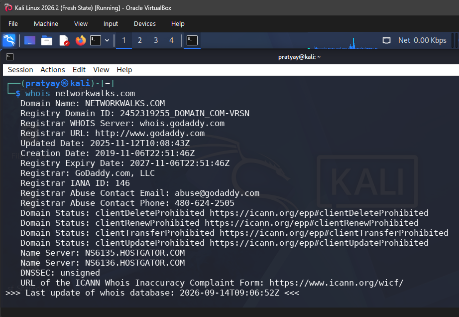
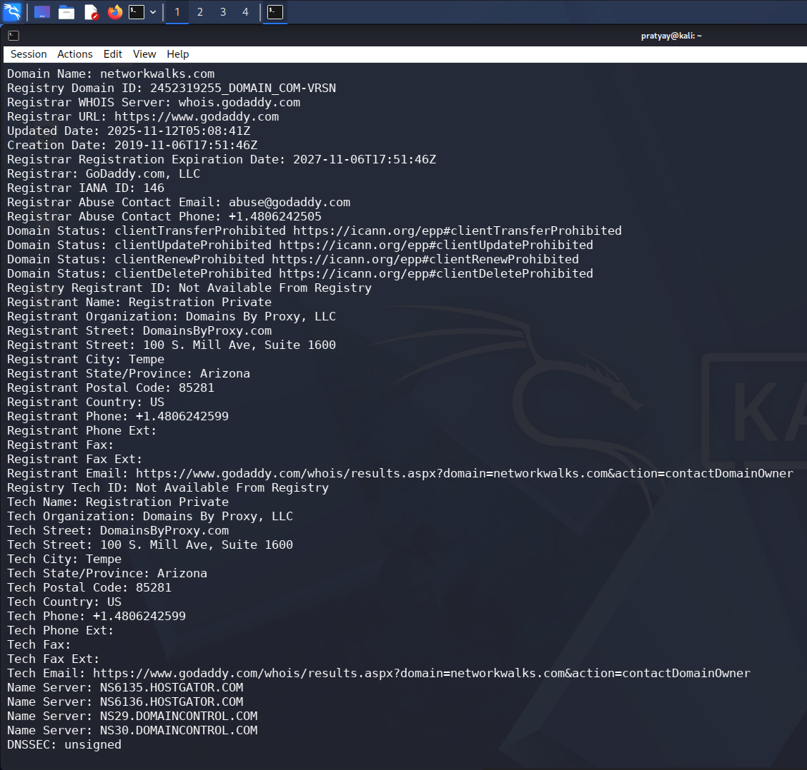

**Key findings:**
- Registrar: **GoDaddy.com, LLC** | Created: 2019-11-06 | Expires: 2027-11-06
- Name Servers: `NS6135.HOSTGATOR.COM`, `NS6136.HOSTGATOR.COM`
- Registrant identity shielded via **Domains By Proxy, LLC** (privacy protection active)
- DNSSEC: **unsigned**

<details>
<summary>📄 Full raw WHOIS output</summary>

```text
Domain Name: NETWORKWALKS.COM
Registry Domain ID: 2452319255_DOMAIN_COM-VRSN
Registrar WHOIS Server: whois.godaddy.com
Registrar URL: http://www.godaddy.com
Updated Date: 2025-11-12T10:08:43Z
Creation Date: 2019-11-06T22:51:46Z
Registry Expiry Date: 2027-11-06T22:51:46Z
Registrar: GoDaddy.com, LLC
Registrar IANA ID: 146
Registrar Abuse Contact Email: abuse@godaddy.com
Registrar Abuse Contact Phone: 480-624-2505
Domain Status: clientDeleteProhibited / clientRenewProhibited /
clientTransferProhibited / clientUpdateProhibited
Name Server: NS6135.HOSTGATOR.COM
Name Server: NS6136.HOSTGATOR.COM
DNSSEC: unsigned
>>> Last update of whois database: 2026-09-14T09:06:52Z <<<

Registrant: Registration Private / Domains By Proxy, LLC
Tempe, Arizona 85281, US
Additional Name Servers: NS29.DOMAINCONTROL.COM, NS30.DOMAINCONTROL.COM
```
</details>

📎 Raw file: [`whois-networkwalks.txt`](./W2-PM1/outputs/whois-networkwalks.txt)

---

#### Task 2 - WhatWeb Fingerprinting
`whatweb networkwalks.com`

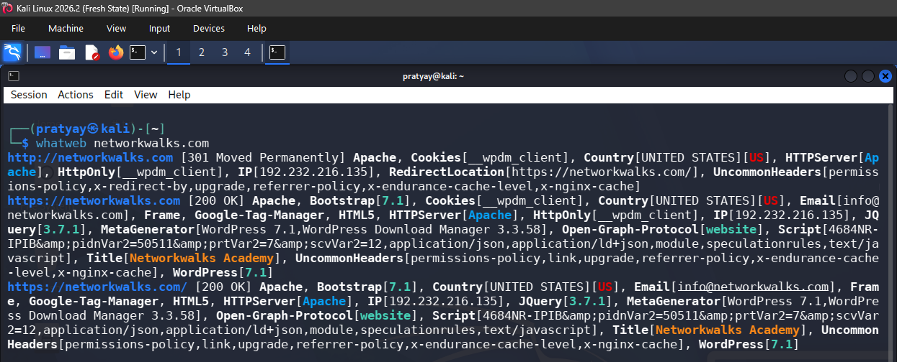

**Key findings:**
- Server: **Apache**, CMS: **WordPress 7.1**, Plugin: **WP Download Manager 3.3.58**
- Server IP exposed: `192.232.216.135`
- Front-end stack: Bootstrap 7.1, jQuery 3.7.1, Google Tag Manager
- ⚠️ Email leaked during fingerprinting: `info@networkwalks.com`

<details>
<summary>📄 Full raw WhatWeb output</summary>

```text
http://networkwalks.com [301 Moved Permanently] Apache, Cookies[__wpdm_client],
Country[UNITED STATES][US], HTTPServer[Apache], HttpOnly[__wpdm_client],
IP[192.232.216.135], RedirectLocation[https://networkwalks.com/],
UncommonHeaders[permissions-policy,x-redirect-by,upgrade,referrer-policy,
x-endurance-cache-level,x-nginx-cache]

https://networkwalks.com [200 OK] Apache, Bootstrap[7.1], Cookies[__wpdm_client],
Country[UNITED STATES][US], Email[info@networkwalks.com], Frame,
Google-Tag-Manager, HTML5, HTTPServer[Apache], HttpOnly[__wpdm_client],
IP[192.232.216.135], JQuery[3.7.1],
MetaGenerator[WordPress 7.1,WordPress Download Manager 3.3.58],
Open-Graph-Protocol[website], Title[Networkwalks Academy], WordPress[7.1]
```
</details>

📎 Raw file: [`whatweb-networkwalks.txt`](./W2-PM1/outputs/whatweb-networkwalks.txt)

---

#### Task 3 - Nslookup Resolution
`nslookup networkwalks.com`

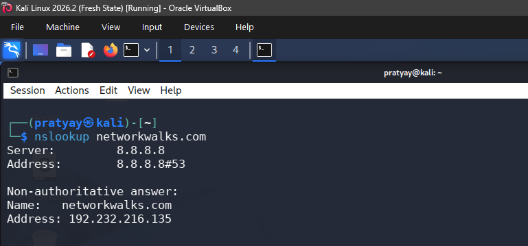

```text
Server: 8.8.8.8
Address: 8.8.8.8#53
Non-authoritative answer:
Name: networkwalks.com
Address: 192.232.216.135
```

**Result:** Confirms `192.232.216.135` — this IP becomes the anchor point for all subsequent header/DNS analysis.

📎 Raw file: [`nslookup-networkwalks.txt`](./W2-PM1/outputs/nslookup-networkwalks.txt)

---

#### Task 4 - Curl HTTP Headers
`curl -I https://networkwalks.com`

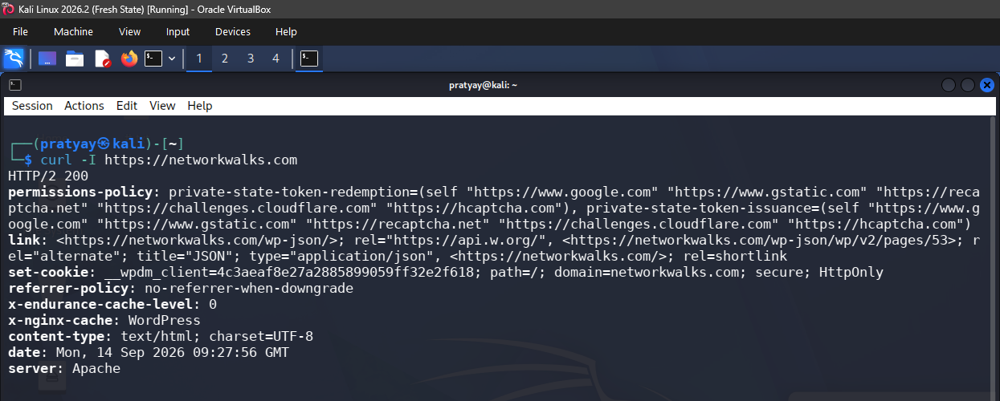

**Key findings:** REST API endpoint exposed (`/wp-json/`), Apache server banner visible, endurance/nginx caching layer identifiable, session cookie `__wpdm_client` set without `Secure`+`SameSite` visibly enforced beyond `HttpOnly`.

<details>
<summary>📄 Full raw curl output</summary>

```text
HTTP/2 200
permissions-policy: private-state-token-redemption=(self "https://www.google.com" ...)
link: <https://networkwalks.com/wp-json/>; rel="https://api.w.org/",
      <https://networkwalks.com/wp-json/wp/v2/pages/53>; rel="alternate"; title="JSON"; type="application/json",
      <https://networkwalks.com/>; rel=shortlink
set-cookie: __wpdm_client=4c3aeaf8e27a2885899059ff32e2f618; path=/; domain=networkwalks.com; secure; HttpOnly
referrer-policy: no-referrer-when-downgrade
x-endurance-cache-level: 0
x-nginx-cache: WordPress
content-type: text/html; charset=UTF-8
date: Mon, 14 Sep 2026 09:27:56 GMT
server: Apache
```
</details>

📎 Raw file: [`curl-headers-networkwalks.txt`](./W2-PM1/outputs/curl-headers-networkwalks.txt)

---

#### Task 5 - Wafw00f WAF Detection
`wafw00f networkwalks.com`

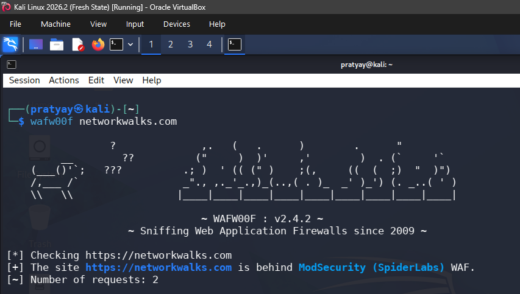

```text
~ WAFW00F : v2.4.2 ~
[*] Checking https://networkwalks.com
[+] The site https://networkwalks.com is behind ModSecurity (SpiderLabs) WAF.
[~] Number of requests: 2
```

**Result:** WAF vendor fingerprintable - informs an attacker which evasion techniques would apply, and confirms to a defender that a WAF is at least active.

📎 Raw file: [`wafw00f-networkwalks.txt`](./W2-PM1/outputs/wafw00f-networkwalks.txt)

---

#### Task 6 - DNSRecon Enumeration
`dnsrecon -d networkwalks.com`

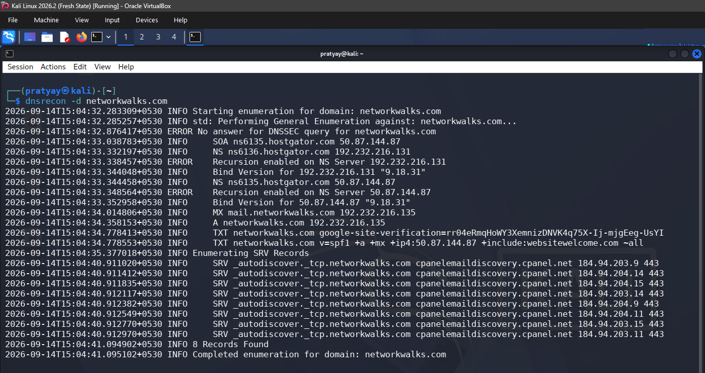

**Key findings:**

| Record | Value |
|---|---|
| SOA | `ns6135.hostgator.com` → `50.87.144.87` |
| NS | `ns6136.hostgator.com` (192.232.216.131), `ns6135.hostgator.com` (50.87.144.87) |
| ⚠️ Recursion | **Enabled on both name servers** (flagged as `ERROR` by DNSRecon) |
| Bind Version | `9.18.31` on both NS |
| MX | `mail.networkwalks.com` → 192.232.216.135 |
| A | `networkwalks.com` → 192.232.216.135 |
| TXT | `google-site-verification=rr04eRmqHoWY3XemnizDNVK4q75X-Ij-mjgEeg-UsYI` |
| SPF | `v=spf1 +a +mx +ip4:50.87.144.87 +include:websitewelcome.com ~all` |
| SRV | 8 records for `_autodiscover._tcp` → `cpanelemaildiscovery.cpanel.net` (8 IPs, port 443) |

<details>
<summary>📄 Full raw DNSRecon output</summary>

```text
[*] SOA ns6135.hostgator.com 50.87.144.87
[*] NS ns6136.hostgator.com 192.232.216.131
[*] NS ns6135.hostgator.com 50.87.144.87
[-] Recursion enabled on NS Server ns6136.hostgator.com [192.232.216.131]
[-] Recursion enabled on NS Server ns6135.hostgator.com [50.87.144.87]
[*] Bind Version for ns6136.hostgator.com: 9.18.31
[*] Bind Version for ns6135.hostgator.com: 9.18.31
[*] MX mail.networkwalks.com 192.232.216.135
[*] A networkwalks.com 192.232.216.135
[*] TXT networkwalks.com google-site-verification=rr04eRmqHoWY3XemnizDNVK4q75X-Ij-mjgEeg-UsYI
[*] TXT (SPF) networkwalks.com v=spf1 +a +mx +ip4:50.87.144.87 +include:websitewelcome.com ~all
[*] SRV _autodiscover._tcp.networkwalks.com cpanelemaildiscovery.cpanel.net 184.94.203.9:443
[*] SRV _autodiscover._tcp.networkwalks.com cpanelemaildiscovery.cpanel.net 184.94.204.14:443
[*] SRV _autodiscover._tcp.networkwalks.com cpanelemaildiscovery.cpanel.net 184.94.204.15:443
[*] SRV _autodiscover._tcp.networkwalks.com cpanelemaildiscovery.cpanel.net 184.94.203.14:443
[*] SRV _autodiscover._tcp.networkwalks.com cpanelemaildiscovery.cpanel.net 184.94.204.9:443
[*] SRV _autodiscover._tcp.networkwalks.com cpanelemaildiscovery.cpanel.net 184.94.204.11:443
[*] SRV _autodiscover._tcp.networkwalks.com cpanelemaildiscovery.cpanel.net 184.94.203.15:443
[*] SRV _autodiscover._tcp.networkwalks.com cpanelemaildiscovery.cpanel.net 184.94.203.11:443
[+] 8 Records Found
```
</details>

📎 Raw file: [`dnsrecon-networkwalks.txt`](./W2-PM1/outputs/dnsrecon-networkwalks.txt)

**PM1 Consolidated Summary:** IP `192.232.216.135` · Stack: WordPress 7.1 + WP Download Manager 3.3.58 on Apache · WAF: ModSecurity (SpiderLabs) · DNS: Bind 9.18.31 (recursive) · REST endpoint: `/wp-json/`

---

### PM2 - Footprinting with GHDB (Google Hacking Database)

**Method:** exploit-db.com's GHDB repository → pre-built Google Dorks → verified in live Google search. This is the most passive module in the entire engagement - no request is ever sent to a "target" server until *manually* clicking a link to confirm it's live.

📎 Full methodology + screenshots: [`footprinting-ghdb.docx`](./W2-PM2/footprinting-ghdb.docx)

#### Task 1 - 10 Live, Accessible Security Camera Feeds

| No. | Link | Dork Used | Login |
|---|---|---|---|
| 1 | http://109.206.96.249:8080/ | `intitle:"webcam" inurl:"8080" -intext:"8080"` | None |
| 2 | http://109.233.191.130:8080/multi.html | `intitle:"webcam" inurl:"8080" -intext:"8080"` | None |
| 3 | http://66.206.54.197/ Display Cameras | `intitle:"Express6 Live Image"` | None |
| 4 | http://109.164.203.165/control/userimage.html | `intitle:"IP CAMERA Viewer" intext:"setting"` | Client setting |
| 5 | https://hj50ac9nwcc.sn.mynetname.net/cctv/ | `intitle:"IP CAMERA Viewer" intext:"setting"` | Client setting |
| 6 | https://tuwebcam.towson.edu/index.html | `intitle:"Webcam" inurl:WebCam.htm` | None |
| 7 | http://72.199.200.5:8080/ | `intitle:webcamxp inurl:8080` | None |
| 8 | http://139.64.168.120:8080/ | `intitle:webcamxp inurl:8080` | None |
| 9 | http://46.253.32.35/camera.htm | `intitle:webcamxp inurl:8080` | None |
| 10 | http://75.149.26.30:1024/ | `intitle:webcamxp inurl:8080` | None |

#### Task 2 - 10 Downloadable Mathematics eBook Repositories

| No. | Link | Dork Used |
|---|---|---|
| 1 | http://erewhon.superkuh.com/library/Math/ | `intitle:index.of "parent directory" mathematics pdf` |
| 2 | https://www.unm.edu/~megrad/Math/ | same |
| 3 | https://www.netlib.org/math/docpdf/ | same |
| 4 | https://education.giakonda.org.uk/Maths/?SD | same |
| 5 | https://www.jsoftware.com/books/pdf/ | same |
| 6 | https://ochicken.net/library/Mathematics/ | same |
| 7 | https://theswissbay.ch/pdf/Gentoomen%20Library/Maths/ | same |
| 8 | https://file.helpstudentpoint.com/wp-content/uploads/2024/04/?SD | same |
| 9 | https://www.maths.dur.ac.uk/papers/2025/ | same |
| 10 | https://lira.epac.to/DOCS-TECH/Math/Engineering%20and%20Applied/ | same |

**Lesson:** None of the above belong to `networkwalks.com` - they're unrelated third-party systems this exercise deliberately surfaces to demonstrate scale. Google indexes *everything* an organization fails to lock down; the same dorking technique run against your **own** domain is a free, zero-cost external-exposure audit.

---

### PM3 - Footprinting with Maltego

**Target:** `networkwalks.com` · **Tool:** Maltego Community Edition 4.11.3

#### Task 1 - Installation

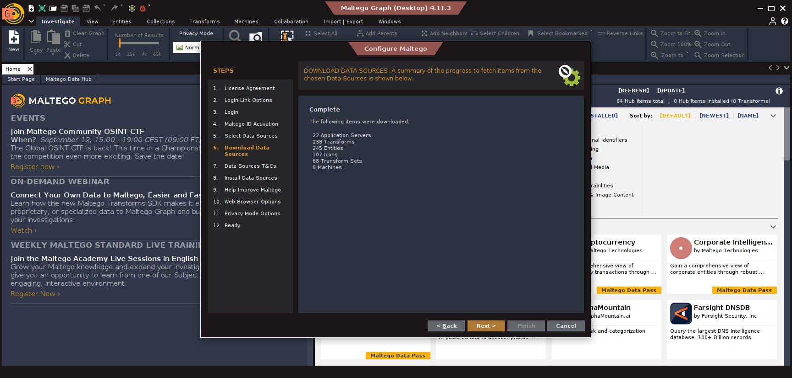
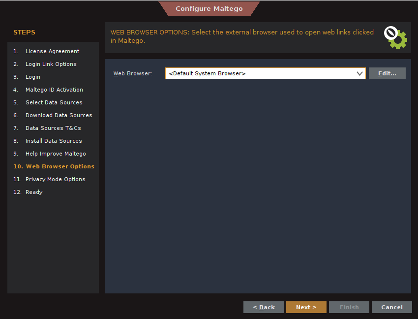
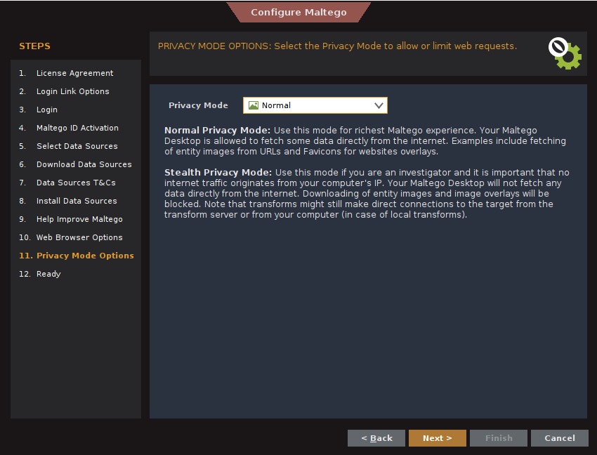
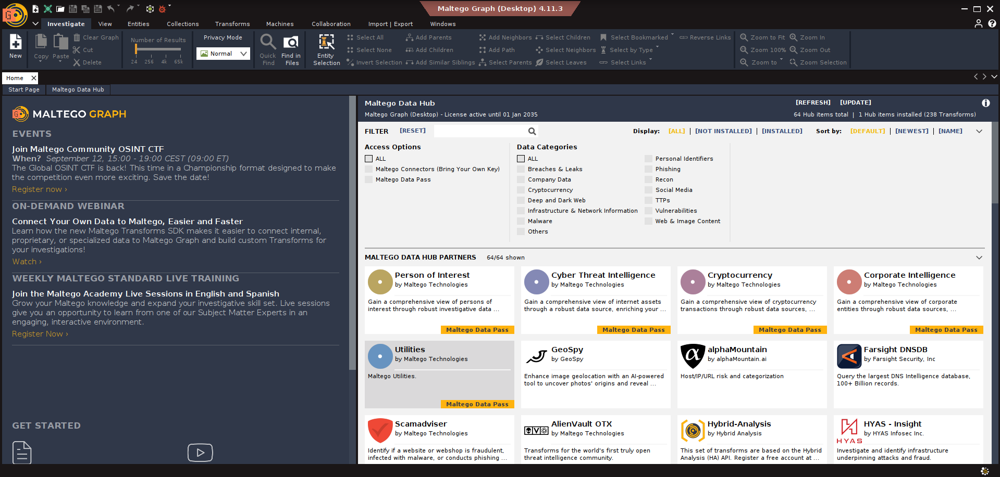

Steps: Java Runtime prerequisite → installer wizard → Maltego ID account creation → browser-based login → Community transforms (Utilities set) installed under Normal privacy mode.

#### Task 2 - Email Harvesting

A `Domain` entity was created for `networkwalks.com`, and 4 transforms were run:

| Transform | What it does |
|---|---|
| `[Utilities] To Email address [From whois info]` | Extracts emails from WHOIS registrant/admin/abuse contact fields |
| `[Utilities] To Email Addresses [PGP]` | Searches public PGP keyservers for keys registered under the domain |
| `[Utilities] To Email Addresses [Search Engine]` | Finds `@domain` mentions indexed across the web |
| `[Utilities] To Emails @domain [Search Engine]` | Same technique, constrained specifically to the target domain suffix |

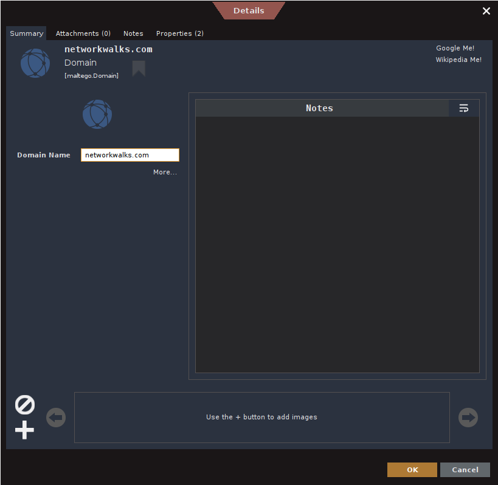
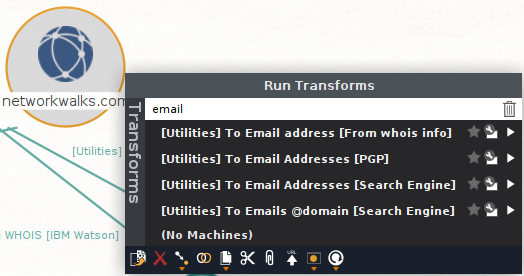
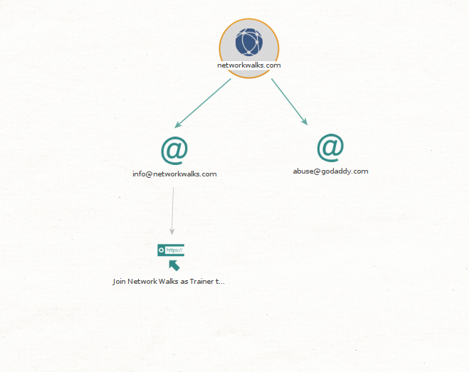
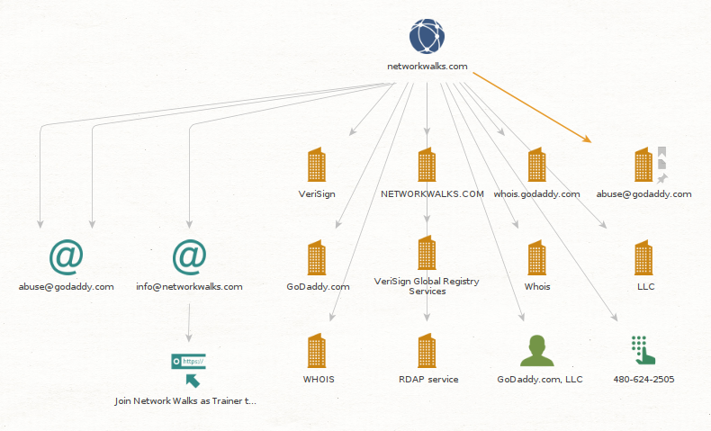

<details>
<summary>🖼️ Detailed entity views (5 screenshots)</summary>

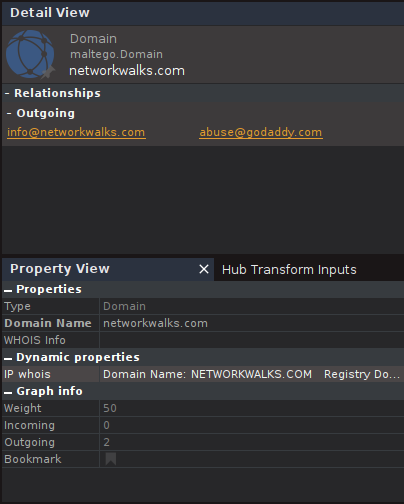
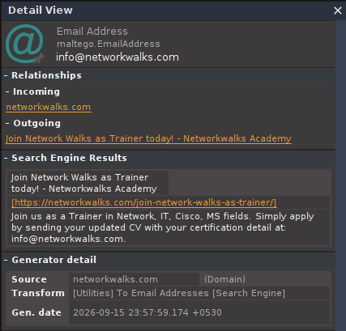
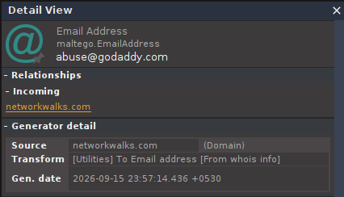
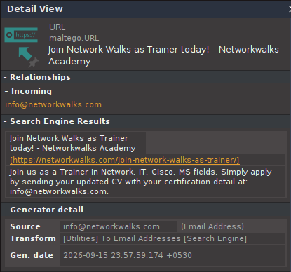
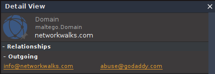

</details>

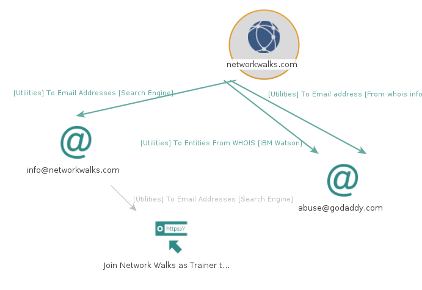

**Emails discovered:** `info@networkwalks.com` and `abuse@godaddy.com`

**Why this matters:** Each harvested email is a phishing/social-engineering entry point. Maltego's value isn't the data itself (theHarvester or manual Google searches can find the same) - it's the **visual graph** that makes relationships between entities immediately obvious to a non-technical stakeholder.

📎 Project file: [`networkwalks-com.mtgl`](./W2-PM3/files/networkwalks-com.mtgl) · Full report: [`networkwalks-com-maltego-report.pdf`](./W2-PM3/files/networkwalks-com-maltego-report.pdf) · Entity table: [`source-target-entity-table.csv`](./W2-PM3/files/source-target-entity-table.csv)

---

### PM4 - Footprinting with theHarvester

**Target:** `microsoft.com` (a large, well-known domain chosen specifically to demonstrate aggregation at scale) · **Tool:** theHarvester 4.11.1

#### Task 1 - Single-Source Search
`theHarvester -d microsoft.com -l 1000 -b baidu`

**Result:** 22 hosts found, 0 IPs, 0 emails via this single source.

<details>
<summary>📄 Full Task 1 output</summary>

```text
theHarvester 4.11.1 — Coded by Christian Martorella
[*] Target: microsoft.com
[*] Searching Baidu.
[*] No IPs found. [*] No emails found. [*] No people found.
[*] Hosts found: 22
---------------------
account.microsoft.com, api.bing.microsoft.com, appsource.microsoft.com,
azure.microsoft.com, careers.microsoft.com, code.msdn.microsoft.com,
community.fabric.microsoft.com, enablement.microsoft.com, fabric.microsoft.com,
graph.microsoft.com, hxd.research.microsoft.com, jobs.careers.microsoft.com,
learn.microsoft.com, msdn.microsoft.com, myaccess.microsoft.com,
officecdn.microsoft.com, securitycopilot.microsoft.com, support.microsoft.com,
support.serviceshub.microsoft.com, techcommunity.microsoft.com,
watson.microsoft.com, wcpstatic.microsoft.com
```
</details>

📎 Raw file: [`task1-theharvester-baidu.txt`](./W2-PM4/outputs/task1-theharvester-baidu.txt)

#### Task 2 - Comprehensive Multi-Source Search
`theHarvester -d microsoft.com -l 50 -b all`

This query hits **27+ data sources simultaneously**. The result set was far too large to embed in full - summarized below with representative highlights, full raw list attached separately.

| Category | Result |
|---|---|
| ASNs found | 7 (AS13335, AS133618, AS14061, AS206834, AS40034, AS8070, AS8075) |
| Interesting URLs | 1 (Microsoft OAuth2 authorize URL via Cloudflare Access) |
| IPs found | 143 (IPv4 + IPv6 across Azure/Microsoft global infra) |
| Emails found | 3 → `dotnet-docker-bot@microsoft.com`, `opencode@microsoft.com`, `secure@microsoft.com` |
| **Hosts found** | **9,957 subdomains** |

**Representative subdomains** (out of 9,957): `academy.microsoft.com`, `azure.microsoft.com`, `learn.microsoft.com`, `graph.microsoft.com`, plus internal-looking entries like `redmond.corp.microsoft.com` and `sys-wingroup.ntdev.corp.microsoft.com` - evidence that even a company of Microsoft's security maturity has an enormous, partially internal-facing subdomain footprint discoverable through free, passive tools.

📎 Full 9,957-host raw output: [`task2-theharvester-all-sources.txt`](./W2-PM4/outputs/task2-theharvester-all-sources.txt)

---

### PM5 - Network Scanning with Zenmap/Nmap

**Target:** Own Lab LAN `10.0.0.0/24` (built in Week 1) · **Baseline:** Kali = `10.0.0.2`, Gateway = `10.0.0.1`

> **Methodology disclosure:** The official task requires a single Ping Scan via the Windows Zenmap GUI. As bonus effort, I additionally ran two deeper scans **directly via `zenmap` CLI in the Kali terminal** rather than the Windows GUI - all three are documented below for full transparency.

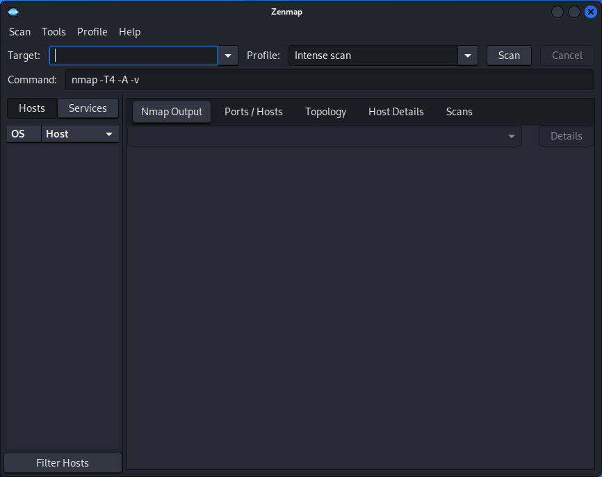
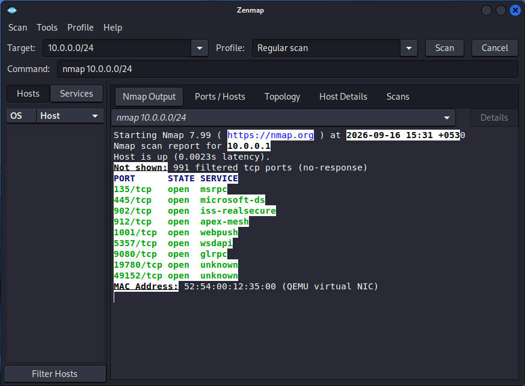

#### (a) Ping Scan - `nmap -sn 10.0.0.0/24`

```text
Starting Nmap 7.99 at 2026-09-16 18:59 +0530
Nmap scan report for 10.0.0.1
Host is up (0.00049s latency).
MAC Address: 52:54:00:12:35:00 (QEMU virtual NIC)
Nmap scan report for 10.0.0.2
Host is up.
Nmap done: 256 IP addresses (2 hosts up) scanned in 2.91 seconds
```

**Result: 2 live hosts** - `10.0.0.1` (gateway) and `10.0.0.2` (Kali itself). This is the single most important validation of the whole engagement: it confirms the Week 1 NAT Network architecture works **exactly as designed**, with slots `10.0.0.3 - 99` sitting empty and ready for future target VMs - no drift, no rogue devices.

📎 Raw file: [`nmap-ping-scan.txt`](./W2-PM5/outputs/zenmap-ping-scan.txt)

#### (b) Intense Scan - `nmap -T4 -A -v 10.0.0.0/24`

ARP Ping Scan confirmed the same 2 live hosts in 1.85s. Deep SYN + version + OS scan then run against both:

**`10.0.0.1` (Gateway) - 9 open TCP ports found:**

| Port | Service | Detail |
|---|---|---|
| 135/tcp | msrpc | Microsoft Windows RPC |
| 445/tcp | microsoft-ds | SMB |
| 902/tcp | ssl/vmware-auth | VMware Auth Daemon 1.10 |
| 912/tcp | vmware-auth | VMware Auth Daemon 1.0 |
| 1001/tcp | webpush? | Unidentified |
| 5357/tcp | http | Microsoft HTTPAPI httpd 2.0 (SSDP/UPnP) |
| 9080/tcp | glrpc? | HTTP 301 → `about:blank` |
| 19780/tcp | unknown | HTTP 400/404/501 (varies by request) |
| 49152/tcp | unknown | Unidentified |

- **OS Detection:** Inconclusive - "just guessing" scored AT&T embedded (95%), Oracle VirtualBox (90%), QEMU (89%), no exact match
- **Host script results:** `smb2-security-mode` → signing **enabled and required** ✅ (a positive control)
- **`10.0.0.2` (Kali):** all 1000 ports **filtered** - no response, as expected for a hardened attacker box
- **Totals:** 256 IPs scanned in 254.95s · 4574 packets sent / 2698 received

📎 Raw file: [`nmap-intense-scan.txt`](./W2-PM5/outputs/zenmap-intense-scan.txt)

#### (c) Slow Comprehensive Scan
`nmap -sS -sU -T4 -A -v -PE -PP -PS80,443 -PA3389 -PU40125 -PY -g 53 --script "default or (discovery and safe)" 10.0.0.0/24`

The most thorough scan of the engagement - 303 NSE scripts, full TCP **and** UDP sweep, ~11.6 minutes runtime.

**`10.0.0.1` - Full port/service table:**

| Port | State | Service | Version/Notes |
|---|---|---|---|
| 135/tcp | open | msrpc | Microsoft Windows RPC |
| 445/tcp | open | microsoft-ds | `smb-enum-services` script failed (execution error) |
| 902/tcp | open | ssl/vmware-auth | VMware Auth Daemon 1.10, banner: "SSL Required" |
| 912/tcp | open | vmware-auth | VMware Auth Daemon 1.0 |
| 1001/tcp | open | webpush? | - |
| 5357/tcp | open | http | Microsoft HTTPAPI httpd 2.0, reverse proxy suspected |
| 9080/tcp | open | glrpc? | HTTP 301 → `about:blank` |
| 19780/tcp | open | unknown | HTTP 400/404/501 depending on request |
| 49152/tcp | open | unknown | - |
| 67/udp | open\|filtered | dhcps | - |
| **69/udp** | **open** | **tftp** | Fingerprint: xdmcp → "Access violation" |
| 137/udp | open\|filtered | netbios-ns | - |
| 1900/udp | open\|filtered | upnp | - |
| 3702/udp | open\|filtered | ws-discovery | - |
| 4500/udp | open\|filtered | nat-t-ike | - |
| 5353/udp | open\|filtered | zeroconf | - |
| 5355/udp | open\|filtered | llmnr | - |

<details>
<summary>📄 Extended host script results (qscan, firewalk, smb-protocols, etc.)</summary>

```text
- qscan latency (8 TCP ports): mean 1143–1260 microseconds, 0% loss
- clock-skew: mean -2s
- path-mtu: PMTU == 1500
- smb-protocols dialects supported: 2.0.2, 2.1, 3.0, 3.0.2, 3.1.1
- ipidseq: Randomized
- msrpc-enum: Could not negotiate connection (SMB error)
- traceroute-geolocation: 1 hop, 0.73ms, no geolocation data
- smb2-security-mode: message signing enabled and required
- firewalk: HOP 0 (10.0.0.2) tcp blocked 1,3-4,6-7,9,13,17,19-20 + udp 67
           HOP 1 (10.0.0.1) udp blocked 137,1900,3702,4500,5353,5355
- smb2-capabilities: Distributed File System, Leasing, Multi-credit ops
- fcrdns: FAIL (No PTR record)
- smb-mbenum: ERROR (browser service negotiation failed)

10.0.0.2 — SYN Stealth (101.25s) + UDP Scan (0.03s): all 2000 ports
"ignored states" (1000 closed UDP port-unreach, 1000 filtered TCP no-response)

Totals: 256 IP addresses (2 hosts up) scanned in 697.45 seconds
Raw packets sent: 6989 (313.390KB) | Rcvd: 6274 (347.458KB)
```
</details>

📎 Raw file: [`nmap-slow-comprehensive-scan.txt`](./W2-PM5/outputs/zenmap-slow-comprehensive-scan.txt)

#### Topology Export

Topology tab → Legend enabled → exported as PDF.

📎 [`topology.pdf`](./W2-PM5/topology.pdf) · [`zenmap-lab-result-networkwalks-academy.pdf`](./W2-PM5/zenmap-lab-result-networkwalks-academy.pdf)

**PM5 Consolidated Summary:** 2 live hosts confirmed matching Week 1 design exactly · Gateway exposes 9 TCP + 7 UDP ports including an unauthenticated-by-design **TFTP** service and **VMware Authentication Daemon** ports (indicating the "gateway" is actually a hypervisor host) · SMB signing correctly enforced · 3 services remain unidentified and warrant manual follow-up.

---

## Reconnaissance Progression

| Stage | Module | Method | Key Output |
|---|---|---|---|
| 1 | PM1 | 6 Kali CLI tools | IP `192.232.216.135`, tech stack, WAF vendor, DNS infra |
| 2 | PM2 | Google Dorking / GHDB | Demonstrated internet-scale public leak indexing |
| 3 | PM3 | Maltego visual mapping | `info@networkwalks.com`, `abuse@godaddy.com` |
| 4 | PM4 | theHarvester aggregation | 9,957 subdomains + 3 corporate emails (microsoft.com) |
| 5 | PM5 | Nmap/Zenmap active scan | 2 live LAN hosts, 9 TCP + 7 UDP ports, topology map |

## Tool Methodology Comparison

| Tool | Input | Output | Detection Risk |
|---|---|---|---|
| WHOIS | Domain | Registration details | None (public database) |
| WhatWeb | Domain | Technology fingerprint | None (passive) |
| Nslookup | Domain | IP address | None (DNS query) |
| Curl | Domain | HTTP headers | None (single request) |
| Wafw00f | Domain | WAF identification | None (passive probing) |
| DNSRecon | Domain | DNS records | None (recursive query test) |
| GHDB | Keywords | Public leaks | None (Google search only) |
| Maltego | Domain | Entity relationships | None (passive) |
| theHarvester | Domain | Multi-source aggregation | None (passive, no direct contact) |
| **Nmap/Zenmap** | **Subnet** | **Live hosts/services** | **⚠️ High (active scanning)** |

---

## Risk Analysis

> ⚠️ These are **observations from reconnaissance**, not confirmed vulnerabilities. No exploitation was attempted at any point in this engagement.

| # | Finding | Source | Impact | Risk |
|---|---|---|---|---|
| 1 | WordPress + plugin versions exposed | PM1 (WhatWeb) | Enables targeted CVE lookup | 🟠 Medium |
| 2 | Origin server IP identifiable | PM1 (WhatWeb/Nslookup) | Allows direct-to-IP scanning, bypassing any CDN | 🟡 Low |
| 3 | REST API + caching headers leaked | PM1 (Curl) | Reveals attack surface & infra stack | 🟡 Low |
| 4 | WAF vendor fingerprintable | PM1 (Wafw00f) | Informs attacker evasion strategy | 🟡 Low |
| 5 | **DNS recursion enabled on authoritative NS** | PM1 (DNSRecon) | Risk of cache poisoning / DNS amplification abuse | 🟠 Medium |
| 6 | Full mail/DNS infrastructure exposed (SRV, MX, SPF) | PM1 (DNSRecon) | Maps secondary attack surface (email infra) | 🟠 Medium |
| 7 | Real employee/organizational emails discoverable | PM3 (Maltego), PM4 (theHarvester) | Phishing & social engineering entry point | 🟠 Medium |
| 8 | Massive subdomain footprint discoverable via free tools | PM4 (theHarvester on microsoft.com) | Demonstrates attack-surface scale even for mature orgs | 🟡 Low (illustrative) |
| 9 | GHDB shows widespread 3rd-party misconfigurations | PM2 | Reinforces need for self-auditing via dorking | 🟡 Low (illustrative) |
| 10 | **Gateway exposes VMware Auth Daemon (902/912/tcp)** | PM5 (Zenmap) | Suggests hypervisor mgmt interface reachable from general LAN | 🟠 Medium |
| 11 | **TFTP (69/udp) open** | PM5 (Zenmap) | TFTP has no built-in authentication - file read/write risk if misconfigured | 🔴 High |
| 12 | 3 unidentified open services (9080, 19780, 49152/tcp) | PM5 (Zenmap) | Unknown attack surface pending manual investigation | 🟠 Medium |
| 13 | SMB message signing enforced | PM5 (Zenmap) | ✅ Positive control - mitigates SMB relay attacks | 🟢 Info (Good) |
| 14 | No reverse DNS (PTR) record for gateway | PM5 (Zenmap `fcrdns`) | Minor - complicates legitimate network troubleshooting/logging | 🟢 Low |
| 15 | Multiple live hosts confirmed on lab subnet | PM5 (Zenmap) | Expected/by-design - validates lab architecture (not a real finding) | 🟢 Info |

---

## Recommendations

1. Keep WordPress core and the WP Download Manager plugin patched to the latest release; monitor version-disclosure headers.
2. Strip/minimize identifying HTTP headers (`server`, cache-layer banners) where feasible without breaking functionality.
3. **Disable open DNS recursion** on the authoritative name servers unless explicitly required for a documented purpose.
4. Run GHDB/Google-dork audits against your **own** domain quarterly to catch accidental indexing before attackers do.
5. Maintain the WAF but don't rely on it alone - layer it with rate-limiting and input validation at the application level.
6. Run phishing-awareness training for staff given the ease of harvesting real organizational email addresses.
7. Prefer role-based aliases (`info@`, `support@`) over exposing individual employee emails in public-facing metadata.
8. **Restrict the VMware Authentication Daemon ports (902/912)** to a dedicated management VLAN - they should not be reachable from the general LAN segment.
9. **Disable TFTP (69/udp)** unless a documented business need exists; if required, restrict source IPs via firewall rules.
10. Investigate and document the 3 unidentified open services (9080, 19780, 49152) to confirm they are legitimate and intended.
11. Continue enforcing SMB signing across all hosts - this control is already working correctly.
12. Institutionalize periodic authorized internal scans (as performed in PM5) to maintain an accurate, drift-free asset inventory.
13. Always document written authorization/scope **before** any active scanning - a practice followed throughout this engagement and worth carrying into every future one.

---

## Key Takeaways

- **Information minimization matters** - WHOIS, DNS, and Google indexing collectively build a surprisingly complete external profile of an organization with zero direct contact.
- **Passive ≠ harmless** - GHDB, Maltego and theHarvester are nearly impossible to detect yet they can surface real emails, subdomains and misconfigurations at massive scale.
- **Active scanning is a different risk category** - Zenmap is detectable and unlike everything else in this engagement requires explicit authorization every single time.
- **Lab validation is real engineering, not just following steps** - the Week 1 NAT Network was designed to hold exactly `10.0.0.1` (gateway) and `10.0.0.2` (Kali) with `10.0.0.3 – 99` reserved for future targets. PM5's ping scan found **precisely** that - proof the architecture holds up under actual tool usage not just on paper.
- **Defenders should think like attackers** - every tool used here (WHOIS through Nmap) is equally useful for an organization auditing its *own* exposure.
- **Documentation is the deliverable** - raw tool output means nothing without risk context, evidence, and remediation guidance attached to it.

---

## Evidence Index

<details>
<summary>📂 Click to expand full file index</summary>

**PM1:** [screenshots/](./W2-PM1/screenshots/) · [outputs/](./W2-PM1/outputs/)
**PM2:** [footprinting-ghdb.docx](./W2-PM2/footprinting-ghdb.docx)
**PM3:** [screenshots/](./W2-PM3/screenshots/) · [files/](./W2-PM3/files/) (`.mtgl`, Maltego PDF report, entity CSV)
**PM4:** [outputs/](./W2-PM4/outputs/) (Task 1 + full Task 2 9,957-host dump)
**PM5:** [screenshots/](./W2-PM5/screenshots/) · [outputs/](./W2-PM5/outputs/) · [topology.pdf](./W2-PM5/topology.pdf)

</details>

---

## Creator

Built and documented by **Pratyay Chandra**

🔗 Week 1 Repository: [NETWORKWALKS-B083F-WK1-PM1-CYBERSECURITY-LAB-SETUP](https://github.com/pratyaychandra/NETWORKWALKS-B083F-WK1-PM1-CYBERSECURITY-LAB-SETUP)
